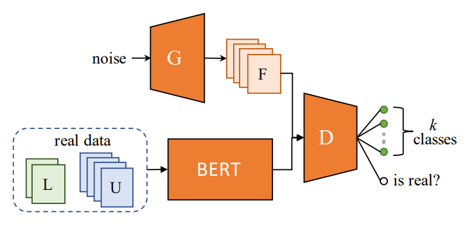
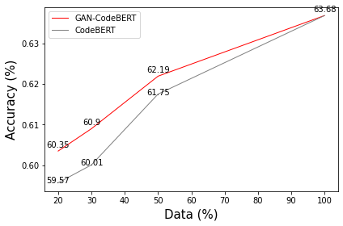

## GAN-CodeBERT

Semi-supervised CodeBERT fine-tuning for Defect Detection.

This work is based on SS-GAN (NIPS 16) and GAN-BERT (ACL 19).

Similar to GAN-BERT, we incorporate the GAN architecture to the classification task and utilize the unlabeled data effectively to accomplish semi-supervised classification.

The framework of GAN-BERT and GAN-CodeBERT is as the following figure:



Our result:



For more details, please refer to our [report]().

### Scripts

File "train.py" and "sstrain.py" are used for finetuning base CodeBERT classifier and semi-supervised GAN-CodeBERT model.

To train models, just run "train.sh" or "sstrain.sh" directly.

```sh
sh train.sh
```

### References

[1] Improved Techniques for Training GANs – NIPs16

[2] GAN-BERT: Generative Adversarial Learning for Robust Text Classification with a Bunch of Labeled Example – ACL19

[3] CodeBERT: A Pre-Trained Model for Programming and Natural Languages – EMNLP20

[4] Devign: Effective vulnerability identification by learning comprehensive program semantics via graph neural networks – NIPs19

[5] CodeXGLUE: A Machine Learning Benchmark Dataset for Code Understanding and Generation
